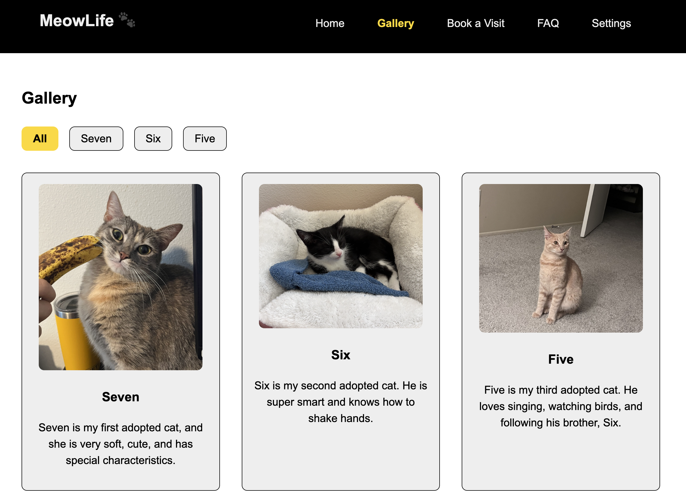

# Lesley Wu — Personal Portfolio

A curated set of projects across full-stack web (React/Vite), desktop apps (JavaFX/PostgreSQL), and serverless automation (Python on AWS Lambda). Each project includes a short overview and quick-start steps.

---

## Repository Structure
```bash

projects/
├─ financial-management-system/       # Personal Financial Management System (JavaFX + PostgreSQL)
├─ meowlife-spa/                      # React + Vite Single-Page App (cats-themed)
├─ cat_notifier_lambda/                 # PawsCat City – New Kitten Notifier (Python + AWS Lambda)
└─ VolleyballClassSignUp/            # Volleyball Auto Sign-Up Bot (Python + AWS Lambda)

```

---

## Projects
### 1) Personal Financial Management System — JavaFX + PostgreSQL
**Path:** [`projects/financial-management-system`](projects/financial-management-system/)  
**Stack:** Java 17, JavaFX, PostgreSQL, JDBC, Maven/Gradle

**Summary:** Desktop finance app with user authentication, transaction CRUD, and monthly analytics (bar/pie charts by category).

**Key Features**
- Sign Up / Login and profile view
- Transactions with amount, category, type (income/expense), date
- Analytics: monthly totals and category breakdown (charts)
- PostgreSQL schema with `users` and `transactions`


### 2) MeowLife SPA — React + Vite
**Path:** [`projects/meowlife-spa`](projects/meowlife-spa)  
**Stack:** React, Vite, plain CSS

**Summary:** A playful SPA demonstrating forms, galleries, and responsive layout while following accessibility best practices.

**Key Features**
- Semantic HTML & ARIA labels; keyboard-friendly navigation
- Client-side form handling in React state
- Responsive CSS (360–1200px), consistent color/typography
- No external JS/CSS libraries (course constraints)




### 3) PawsCat City – New Kitten Notifier — Python + AWS Lambda
**Path:** [`projects/cat_notifier_lambda`](projects/cat_notifier_lambda)  
**Stack:** Python 3.x, AWS Lambda, Amazon EventBridge, Amazon SES, Requests, BeautifulSoup 

**Summary:** Serverless scraper that checks PawsCat City’s new-kitten listings and emails me when new arrivals appear.

**Key Features**
- Scheduled checks via EventBridge (cron/rate)
- Parses the shelter page and detects new listings (optional S3/DynamoDB for de-dup)
- Sends alerts via Amazon SES
- Lightweight, low-cost Lambda deployment


### 4) Volleyball Auto Sign-Up Bot — Python + AWS Lambda
**Path:** [`projects/VolleyballClassSignUp`](projects/VolleyballClassSignUp)  
**Stack:** Python 3.x, AWS Lambda, Amazon EventBridge, Requests (optional Playwright), BeautifulSoup

**Summary:** Automatically submits the volleyball class sign-up form right when registration opens so I don’t miss spots.

**Key Features**
- Precise trigger at sign-up time via EventBridge
- Builds and posts the form payload; optional fetch for CSRF token/cookies
- Optional dry-run mode and custom headers/user-agent
- Playwright-based path available for JS-heavy pages


### 5) NBA Cards Market — React + Vite + Express
**Path:** [`projects/NBA-card-market`](projects/NBA-card-market)  
**Stack:** React, Vite, Express (Node.js), cookie-based sessions, RESTful JSON APIs

**Summary:** A full-stack e-commerce SPA for buying, managing, and administering NBA trading cards. Users can register, log in, browse inventory, manage carts, and place orders, while admins manage card inventory and review all orders.

**Key Features**
- React + Vite front-end SPA with session-aware navigation and dynamic UI rendering
- Express backend with RESTful APIs for cards, carts, orders, authentication, and admin controls
- Secure-ish session-based auth (`sid` cookies), with three roles: user, admin (`nba_admin`), and banned (`dog`)
- Real-time stock validation, cart quantity rules, and order snapshotting to preserve purchase history
- Admin dashboard for inventory CRUD operations and order status management
- No external JS/CSS libraries; uses `fetch()` + Promises for all network operations


---

## Contact
Lesley (Xinyu) Wu — Seattle/Bellevue

[`linkedin.com/in/xinyu-lesley-wu-5518a6194`](linkedin.com/in/xinyu-lesley-wu-5518a6194)
